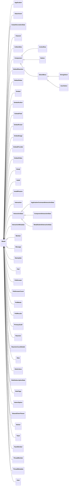

---
hide:
  - toc
  - navigation
---
# Zcord Class Diagram

```mermaid
classDiagram
    direction LR

    Component <|-- ActionRow
    Model <|-- Application
    InteractionData <|-- ApplicationCommandInteractionData
    Model <|-- Attachment
    Model <|-- AvatarDecorationData
    Component <|-- Button
    Model <|-- Channel
    Model <|-- Collectibles
    Model <|-- Component
    InteractionData <|-- ComponentInteractionData
    Model <|-- DefaultReaction
    Model <|-- DefaultValue
    Model <|-- Embed
    Model <|-- EmbedAuthor
    Model <|-- EmbedField
    Model <|-- EmbedFooter
    Model <|-- EmbedImage
    Model <|-- EmbedProvider
    Model <|-- EmbedVideo
    Model <|-- Emoji
    Model <|-- Guild
    Model <|-- InstallParams
    Model <|-- Interaction
    Model <|-- InteractionData
    Model <|-- InteractionMetadata
    Model <|-- Member
    Model <|-- Message
    InteractionData <|-- ModalSubmitInteractionData
    Model <|-- Nameplate
    Model <|-- Poll
    Model <|-- PollAnswer
    Model <|-- PollAnswerCount
    Model <|-- PollMedia
    Model <|-- PollResults
    Model <|-- PrimaryGuild
    Model <|-- Reaction
    Model <|-- ReactionCountDetails
    Model <|-- Role
    Model <|-- RoleColors
    Model <|-- RoleSubscriptionData
    Model <|-- RoleTags
    Component <|-- SelectMenu
    Model <|-- SelectOption
    Model <|-- SharedClientTheme
    Model <|-- Sticker
    SelectMenu <|-- StringSelect
    Model <|-- Team
    Model <|-- TeamMember
    Model <|-- ThreadMember
    Model <|-- ThreadMetadata
    Model <|-- User
    SelectMenu <|-- UserSelect
```
